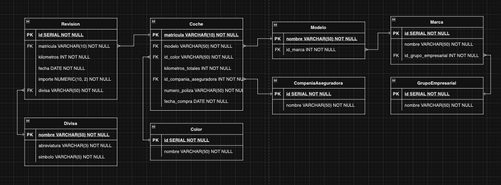

<h1 align="center">
  <strong>Bootcamp Desarrollo de Apps Móviles</strong>
</h1>

---

  <strong>Módulo: Modelado de datos e introducción a SQL</strong>

---

  <strong>Autor:</strong> Salva Moreno Sánchez

  

## Índice

* [Contenidos dados en el módulo](#contenidos)
	* [Primera sesión](#primeraSesion)
	* [Segunda sesión](#segundaSesion)
	* [Tercera sesión](#terceraSesion) 
* [Herramientas](#herramientas)
* [Práctica: modelado y SQL](#practica)
	* [Descripción](#descripcion)
	* [Diagrama Entidad-Relación](#diagrama)
	* [Ejemplificaciones del *script* `gestionFlota.sql`](#ejemplos)
	* [Problemas, decisiones y resolución](#problemas)
		* [Planificación y ejecución del diagrama Entidad-Relación](#planificacion) 
* [Complementación de los conceptos vistos](#complemento)

## Contenidos dados en el módulo

### Primera sesión

* **Modelo Entidad-Relación**
	* Entidades
	* Atributos y tipos de datos
	* ¿Qué es una relación?
		* Relaciones entre entidades
		* Cardinalidad  
* **Normalización**
	* Primera, Segunda y Tercera Forma Normal
	* Desnormalización 

### Segunda sesión

* **DDL (*Data Definition Language*)**
	* Creación de tablas
	* Modificación de tablas
	* Creación de relaciones e índices
* **DML (*Data Manipulation Language*)**
	* Extracción de datos con *Select*
	* Inserción de registros con *Insert* 
	* Actualización de registros con *Update*

### Tercera sesión

* **DML (*Data Manipulation Language*)**
	* Consultas avanzadas haciendo uniones de tablas 
* **Ejercicio práctico:**
	*  Cargar un *set* de datos desnormalizado en Excel en una base de datos normalizada haciendo uso de consultas avanzadas

## Herramientas

  
  
  

## Práctica: modelado y SQL

### Descripción

La práctica que nos ocupa en este módulo del *bootcamp* trata de dar solución a la gestión de la flota de vehículos de una empresa, la cual nos pasaría su almacén de datos en formato Excel para construir una **base de datos**.

De esta forma, y atendiendo al tipo de datos que poseemos, debemos adentrarnos en el importante proceso de planificación y conformación del **diagrama Entidad-Relación** para, luego, plasmar todo ello a través del sistema de gestión de bases de datos relacional **PostgreSQL**, en el que tendremos un *script* con los comandos DDL (*Data Definition Language*) para la creación del modelo diseñado, así como los comandos DML (*Data Manipulation Language*) para cargar las tablas.

Dicho *script* (llamado `gestionFlota.sql` en el repositorio) es totalmente autónomo, es decir, al ejecutarlo crea todo lo necesario (tablas, *primary keys*, *foreign keys*, relaciones, atributos, mapeo de los datos desde el modelo no normalizado del cliente al nuestro, etc.).

### Diagrama Entidad-Relación

Aquí se muestra el diagrama Entidad-Relación realizado para nuestro caso, el cual refleja la representación del modelo de datos normalizado que emplearemos y llevaremos a código para la construcción de nuestra base de datos.

En él, podemos observar las distintas entidades definidas por sus atributos y relaciones, atendiendo a la correspondencia de cardinalidad adecuada.

**Nota:** en este repositorio se encuentra dicho diagrama para poder descargarlo (`diagrama_entidadRelacion.drawio` / `diagrama_entidadRelacion.xml`) y visualizarlo en [draw.io](https://app.diagrams.net), herramienta empleada para la representación del mismo.

### Ejemplificaciones del *script* `gestionFlota.sql`

#### Creación de la tabla `coche`

~~~sql
CREATE TABLE gestionFlota.coche (
	matricula VARCHAR(10) primary key not null,
  	modelo VARCHAR(50) not null references gestionFlota.modelo(nombre),
  	id_color INT not null references gestionFlota.color(id),
  	kilometros_totales INT not null,
  	id_compania_aseguradora INT not null references gestionFlota.companiaAseguradora(id),
  	numero_poliza VARCHAR(50) not null,
  	fecha_compra DATE not null
);
~~~

#### Carga de datos en la tabla `coche` desde el modelo no normalizado dado por cliente

~~~sql
INSERT INTO gestionFlota.coche (matricula, modelo, id_color, kilometros_totales, id_compania_aseguradora, numero_poliza, fecha_compra)
SELECT matricula, gestionFlota.modelo.nombre, gestionFlota.color.id, kms_totales, gestionFlota.companiaAseguradora.id, n_poliza, fecha_compra 
FROM gestionFlota.coches
INNER JOIN gestionFlota.color
ON gestionFlota.coches.color = gestionFlota.color.nombre
INNER JOIN gestionFlota.modelo
ON gestionFlota.coches.modelo = gestionFlota.modelo.nombre
INNER JOIN gestionFlota.companiaAseguradora
ON gestionFlota.coches.aseguradora = gestionFlota.companiaAseguradora.nombre;
~~~

#### *Query* final para comprobar nuestro modelo de datos normalizado

Se nos reclama extraer el listado de coches que hay mostrando lo siguiente:

* Modelo, marca y grupo empresarial.
* Fecha de compra.
* Matrícula.
* Nombre del color del coche.
* Kilómetros totales.
* Nombre de la empresa que está asegurando el coche.
* Número de poliza.

~~~sql
SELECT 
modelo, 
gestionFlota.marca.nombre AS marca, gestionFlota.grupoEmpresarial.nombre AS grupo_empresarial, 
fecha_compra, 
matricula,
gestionFlota.color.nombre AS color,
kilometros_totales,
gestionFlota.companiaAseguradora.nombre AS compania_aseguradora,
numero_poliza
FROM gestionFlota.coche
INNER JOIN gestionFlota.color
ON gestionFlota.coche.id_color = gestionFlota.color.id
INNER JOIN gestionFlota.modelo
ON gestionFlota.coche.modelo = gestionFlota.modelo.nombre
INNER JOIN gestionFlota.marca
ON gestionFlota.modelo.id_marca = gestionFlota.marca.id
INNER JOIN gestionFlota.grupoEmpresarial
ON gestionFlota.marca.id_grupo_empresarial = gestionFlota.grupoEmpresarial.id
INNER JOIN gestionFlota.companiaAseguradora
ON gestionFlota.coche.id_compania_aseguradora = gestionFlota.companiaAseguradora.id;
~~~

### Problemas, decisiones y resolución

#### Planificación y ejecución del diagrama Entidad-Relación

Considero vital la parte de planificación, ya sea para la arquitectura de *software* o, en este caso, para la construcción de una base de datos; la cual tiene su resultado a través de la representación del diagrama Entidad-Relación y que, una vez realizado y contrastado, nos va a facilitar el trabajo en gran medida para luego llevarlo a código.

No he tenido grandes problemas que no me hayan permitido avanzar; sin embargo, puedo destacar que, una vez que tenía casi hecha la base de datos, me percaté de que podía seguir normalizando mi modelo y crear otra entidad. Me ocurrió con el atributo `color` en la entidad `coche`, el cual lo pude abstraer en otra entidad y tenerlo como *foreign key* en `coche`. 

Reflexionando sobre ello, y aunque es un caso simple que tuve que resolver desde un principio en la fase de planificación y normalización del modelo, lo achaco a que no se ha contrastado el diagrama con la visión de otras personas o bajo una batería de pruebas que ayudarían a cerciorarnos de cuán normalizado está nuestro modelo. Lo que significa, para mí, un aprendizaje resultante del trabajo de esta práctica.

## Complementación de los conceptos vistos

Las clases impartidas en este módulo las he querido complementar con el visionado de un curso ofrecido por la plataforma educativa [freeCodeCamp](https://www.freecodecamp.org) llamado [Learn PostgreSQL Tutorial - Full Course for Beginners](https://www.youtube.com/watch?v=qw--VYLpxG4) de 4 horas de duración en el que he podido profundizar en conceptos vistos en el módulo del Bootcamp y, además, aprender nueva sintaxis y a usar PostgreSQL a través de la consola, lo cual me ha permitido abstraer dicha tecnología de la interfaz de usuario de DBeaver.

---

[Subir ⬆️](#top)
